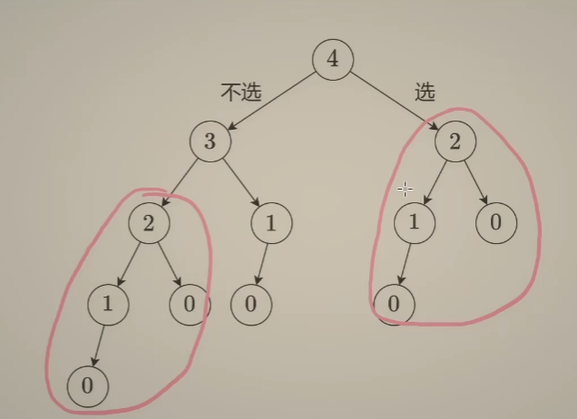

> **核心思想**：当前状态的最优解，来源于之前状态的最优解

**基础题目**：198. 打家劫舍

**扩展题目**：

- 爬楼梯
- 使用最小花费爬楼梯
- 爬楼梯 II
- 打家劫舍 II

------

## 一、什么是动态规划？

很多人第一次接触动态规划，都会被「状态转移方程」劝退。但实际上，**动态规划并不是一种“新算法”，而是回溯的一种系统性优化**。

> 动态规划 = 回溯 + 去重 + 自底向上

理解动态规划，最自然的一条路径是：

> **回溯 → 记忆化搜索 → 递推（DP）**

下面我们通过「打家劫舍」这个经典问题，完整走一遍这条路径。

------

## 二、从回溯开始：暴力 DFS 的本质

以 **198. 打家劫舍** 为例：

- 每一间房子：**选 or 不选**
- 不能选相邻的房子

我们从“最后一个房子”开始思考，定义：

> **dfs(i)**：考虑前 `i` 个房子，能偷到的最大金额

那么对于第 `i` 个房子：

- 不偷：最大金额 = `dfs(i - 1)`
- 偷：最大金额 = `dfs(i - 2) + nums[i]`

得到递归公式：

```
dfs(i) = max(dfs(i - 1), dfs(i - 2) + nums[i])
```

但问题也随之而来：**大量重复计算**。



可以看到：

- `dfs(2)` 被计算了多次
- `dfs(1)` 被计算了更多次

这正是 **动态规划要解决的核心问题：重复子问题**

------

## 三、记忆化搜索：给回溯加“缓存”

回溯的问题不在于“递归”，而在于 **重复递归**。

解决方法也很直接：

> **算过的结果，存下来，下次直接用**

这就是 **记忆化搜索（Memoization）**。

### Java 示例

```
private int dfs(int i, int[] nums, int[] cache) {
    if (i < 0) {
        return 0;
    }
    if (cache[i] != -1) {
    	// 之前计算过,直接返回
        return cache[i];
    }
    // 之前没算过，将当前结果缓存
    cache[i] = Math.max(
        dfs(i - 1, nums, cache),
        dfs(i - 2, nums, cache) + nums[i]
    );
    return cache[i];
}
```

此时：

- 时间复杂度：从指数级 ➜ **O(n)**
- 但仍然有：
  - 递归栈空间
  - cache 数组空间

接下来就是最后一步优化空间复杂度：**递推**

------

## 四、从记忆化搜索到递推（真正的 DP）

观察记忆化搜索中的递归关系：

- `dfs(2)` 依赖 `dfs(1)` 和 `dfs(0)`
- `dfs(3)` 依赖 `dfs(2)` 和 `dfs(1)`
- ……

这说明：

> **状态之间的依赖顺序是确定的**

既然如此，我们完全可以：

- 不再“递”
- 只保留“归”
- **从小到大计算每一个状态**

### 递推（DP）的三要素

从记忆化搜索到递推，本质上完成了三件事：

1. **状态数组（dp）**：`dp[i]` 记录 `dfs(i)` 的结果
2. **循环代替递归**：从 `i = 0` 推到 `n`
3. **初始化代替递归边界**：`dp[0]`、`dp[1]` 对应原来的递归边界

### 为什么叫“递推”？

> 因为当前状态是 **由之前状态推导出来的**

在打家劫舍中：

- 偷到第 `i` 间房子的最大金额
   **不是只由第 `i` 间房子决定的**
- 而是由：
  - 第 `i-1` 间房子的最优解
  - 第 `i-2` 间房子的最优解
     共同决定

这正是动态规划中最核心的结构：

> **最优子结构**

------

## 五、空间优化：从 O(n) 到 O(1)

在打家劫舍中：

```
dp[i] 只依赖 dp[i-1] 和 dp[i-2]
```

因此：

- 不需要完整 dp 数组
- 只需要保存「前两个状态」

 空间复杂度可进一步优化为 **O(1)**

------

## 六、结合具体题目总结 DP 模型

### 70. 爬楼梯

- **状态定义**：`dp[i]` = 爬到第 i 阶的方法数
- **递推公式**：

```
dp[i] = dp[i - 1] + dp[i - 2]
```

- **初始化**：
  - `dp[0] = 1`
  - `dp[1] = 1`
- **答案**：`dp[n]`

本质：**斐波那契数列**

------

### 746. 使用最小花费爬楼梯

- **状态定义**：`dp[i]` = 到达第 i 阶的最小花费
- **递推公式**：

```
dp[i] = min(dp[i - 1] + cost[i - 1],
            dp[i - 2] + cost[i - 2])
```

- **初始化**：
  - `dp[0] = 0`
  - `dp[1] = 0`
- **答案**：`dp[n]`

特点： **不是计数，而是最小值优化**

------

### 3693. 爬楼梯 II

- 一次可以跳 **1 / 2 / 3** 阶
- **递推公式**：

```
dp[i] = dp[i - 1] + dp[i - 2] + dp[i - 3]
```

本质变化只有：

> **当前状态依赖的“历史状态数量”变多了**，计算 cost 的方式不同了

------

### 213. 打家劫舍 II（环形）

核心难点：

> **首尾不能同时选**

经典处理方式：

- 情况一：不偷第 0 间 ➜ 偷 `[1 … n-1]`
- 情况二：不偷第 n-1 间 ➜ 偷 `[0 … n-2]`
- 对两种情况分别做 **198 打家劫舍**
- 取最大值

 **环形 DP → 拆成两个线性 DP**

------

## 七、心得与方法论总结

### 动态规划到底“动”在哪？

- 状态是变化的
- 当前状态来自之前状态
- 本质是 **dfs 中的“归”**

递推，其实就是：

> **省略 dfs 的“递”，只保留“归”**

------

### 想不出递推公式怎么办？

一个非常实用的技巧：

> **回退一步，用回溯 + 记忆化搜索先写出来**

- 回溯天然符合“选 or 不选”
- 递归公式写出来后
- 直接“翻译”为 dp 即可

------

### 什么时候应该想到动态规划？

当题目满足以下特征之一时，**高度警惕 DP**：

- 当前结果依赖之前的结果
- 有“最优”“最多”“最少”“方案数”等关键词
- 存在大量重复子问题
- 能清晰定义「状态」

一句话总结：

> **只要当前状态是在之前状态的基础上演化而来，就可以尝试动态规划**

------

## 结语

动态规划并不是死记模板，而是一种 **从回溯中抽象出的系统性思维方式**。
真正掌握 DP 的标志，不是会写状态转移方程，而是：

> **能从回溯自然地推导出递推**

## 相关代码

本文涉及的所有代码与笔记，均已同步至我的 GitHub 算法仓库，作为 Java 后端校招过程中的学习记录。