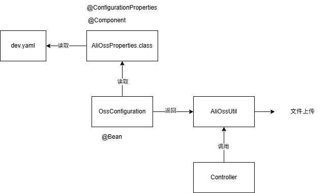

> 本文基于一个真实后端业务系统（Spring Boot + MyBatis）的实现过程，系统性总结了三个实际开发中遇到的问题：**公共字段填充、文件上传服务设计、多表业务模块实现**。

------

## 一、公共字段自动填充：用 AOP 解耦“横切逻辑”

### 问题背景（Why）

在一个标准的后端系统中，**几乎所有业务表**都会包含以下公共字段：

| 字段        | 含义     |
| ----------- | -------- |
| create_time | 创建时间 |
| create_user | 创建人   |
| update_time | 修改时间 |
| update_user | 修改人   |

如果在每个 `insert / update` 的 Mapper 方法中**手写赋值逻辑**，会带来三个问题：

1. **重复代码严重**
2. **业务代码被污染**
3. **容易遗漏或写错**

这是一个非常典型的 **横切关注点（Cross-Cutting Concern）**。

------

### 设计目标

从工程角度，我希望这个功能满足：

- 业务代码 **零侵入**
- 插入 / 更新行为 **语义清晰**
- 能够 **统一治理、集中维护**

因此选择方案是：

> **Spring AOP + 自定义注解**

------

### 实现方案概述

整体设计拆分为三层职责：

1. **注解层**：声明“这个方法需要自动填充”
2. **切面层**：统一拦截、统一处理
3. **实体层**：通过反射注入公共字段

------

### 核心实现解析

#### （1）自定义注解：表达“意图”

```
@Target(ElementType.METHOD)
@Retention(RetentionPolicy.RUNTIME)
public @interface AutoFill {
    OperationType value(); // INSERT / UPDATE
}
```

**关键点：**

- 不关心“填充什么字段”
- 只关心“这是一次什么操作”
- 将 **业务语义** 与 **实现细节** 完全解耦

------

#### （2）切面设计：拦截 + 分类处理

```
@Pointcut("execution(* com.sky.mapper.*.*(..)) && @annotation(com.sky.annotation.AutoFill)")
public void autoFillPoinCut() {}
```

- 只拦截 Mapper 层
- 只拦截显式声明了 `@AutoFill` 的方法
- 避免 **误伤 / 全局污染**

------

#### （3）前置通知：为什么是 @Before？

```
@Before("autoFillPoinCut()")
public void autoFill(JoinPoint joinPoint) { ... }
```

**原因很简单但很关键：**

> 公共字段必须在 SQL 执行之前完成赋值，否则 ORM 层拿到的是脏数据。

------

#### （4）反射注入字段

```
Method setCreateTime = entity.getClass()
    .getDeclaredMethod("setCreateTime", LocalDateTime.class);
```

### 拓展问题

- 为什么不用接口？
- 为什么不用父类？
- 如果实体不包含这些字段怎么办？

>答：
>
>* 因为这是**内部约定型的横切逻辑**，不需要多态，接口会增加侵入性和实现成本。如果做成通用框架或给第三方用，才会考虑接口约束。
>* 父类会强制所有实体继承，**破坏领域模型独立性**，而 AOP + 反射只对“需要的地方”生效，更灵活。
>* 可以加字段存在性校验并抛异常。

------

## 二、文件上传服务：从“能用”到“可扩展”

### 存储方案对比（Why）

| 方案           | 优点       | 缺点     |
| -------------- | ---------- | -------- |
| 本地磁盘       | 简单       | 扩容困难 |
| 分布式文件系统 | 可扩展     | 运维复杂 |
| 第三方 OSS     | 易用、稳定 | 成本     |

在实际项目中，选择的是：

> **云厂商 OSS（阿里云 OSS ）**

------

### OSS 上传整体流程



------

### 实现关键点

#### （1）密钥安全

- 使用 **RAM 子账号**
- 通过 **环境变量** 注入 AccessKey
- **不写死、不提交到仓库**

```
setx OSS_ACCESS_KEY_ID "xxx"
setx OSS_ACCESS_KEY_SECRET "xxx"👉 面试官会非常在意这一点。
```

------

#### （2）配置解耦

- YAML 配置
- `@ConfigurationProperties` 注入
- 工具类 + Spring 管理

这说明你理解：

> **配置 ≠ 代码**

------

#### （3）上传核心逻辑

```
ossClient.putObject(
    bucketName,
    objectName,
    new ByteArrayInputStream(bytes)
);
```

在这里你做的是：

- 将 I/O 细节 **封装在基础设施层**
- Controller 只负责 **接收请求与返回结果**

------

### 拓展问题

- 如何避免文件名冲突？
- 如何做断点续传？
- 如何限制文件类型 / 大小？

>答：
>
>* UUID+随机数
>* 采用 **分片上传**，每个分片单独上传并记录状态，失败只重传缺失分片，最终由 OSS 合并。
>* 后端校验 `Content-Type`、文件大小，并做必要的内容校验

------

## 三、菜品管理模块：典型多表业务设计

------

### DTO / VO 分离

- DTO：接收请求
- Entity：数据库映射
- VO：返回前端

当实体类与请求参数相差较大时，需要引入 DTO；同时返回数据与实体类相差较大时，引入 VO

------

### 主从表插入

```
<insert useGeneratedKeys="true" keyProperty="id">
```

- 先插主表
- 拿主键
- 再批量插从表

```
<foreach collection="flavors" item="df" separator=",">
```

------

### 删除逻辑：业务约束优先于数据库

- 起售中的菜品不能删除
- 不是靠外键
- 而是靠 **业务校验 + 自定义异常**

> **数据库外键 ≠ 业务约束**

------

### 更新策略：先删后插

```
update dish
delete flavors
insert flavors
```

- 简化逻辑
- 保证一致性
- 配合事务使用

------

## 学习资料与完整代码

**已整理并上传至 GitHub 仓库**

